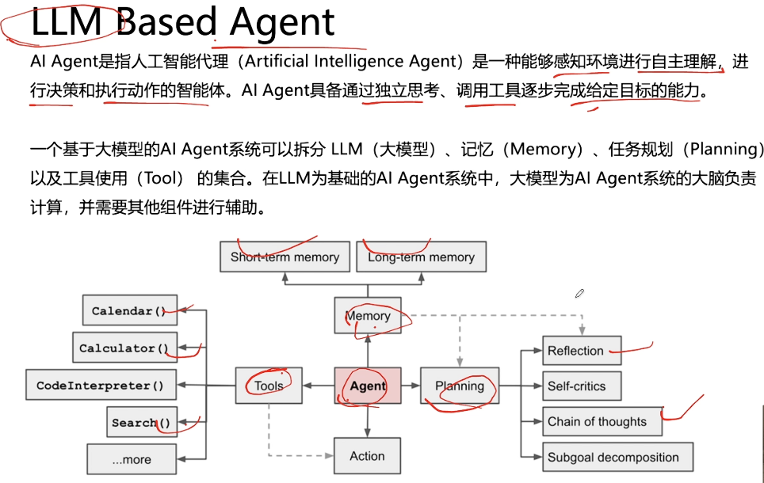
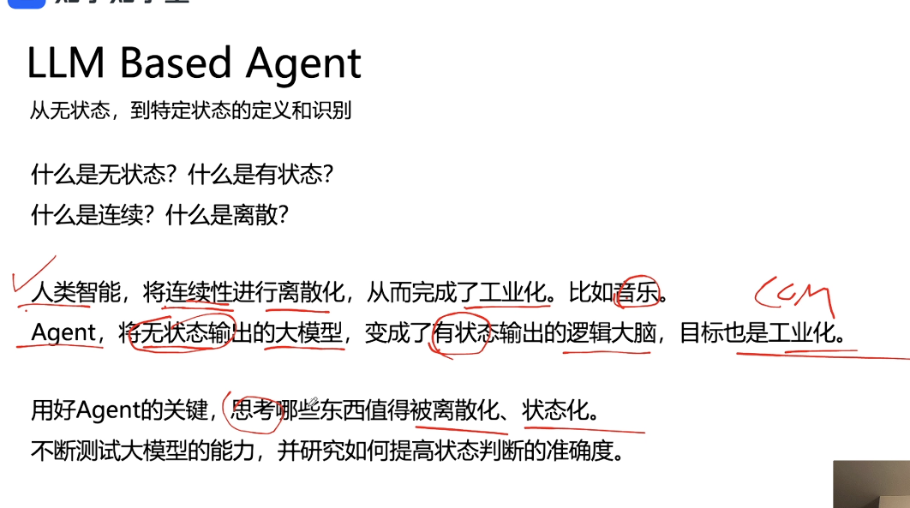
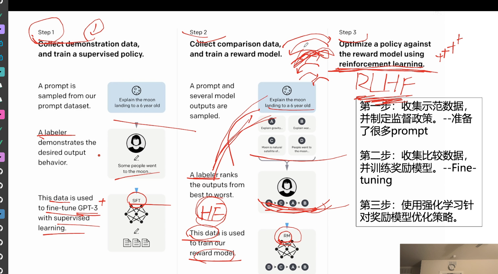

<!-- more -->

## 产品举例

- 支小助
- AiPPT
- HeyGen数字人
- 美团-小美AI Agent
- 星野-AI陪聊智能体
- meitu

## 入行需要的步骤

1. 首先要了解AI的模型和技术应用知识（作用：从基座模型二开）
2. 熟练使用AI开发工具
3. 要构建AI驱动的原型，需要将概念转化为实际应用
4. 保持AI最新技能同步
5. 不断学习和做项目实战

## 需要掌握什么技术？

## AI技术介绍

### Agent

从无状态，到特定状态的定义和识别

状态：（报出的回答结构化）

巴黎奥运会的金牌回答，可以按照金银铜牌的数量回答给用户

### Prompt

提示词工程，用户输入

### Function Call

与外部函数或API交互的能力，通过理解语义来结构化调用信息，询问用户补全信息，然后结构化调用工具，基于返回的结构化信息，整合生成回复

面试题：如果Function Call的成功率比较低，需要怎么解决？

答案：考虑从LLM基座模型或者选型上去思考

### RAG

通过从外部资源或数据库中纳入相关信息来实现

### Fine Tuning

微调（可能不需要，但是复杂场景需要，可以先考虑模型的选型）

## 必须要懂的算法原理

